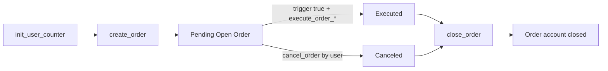
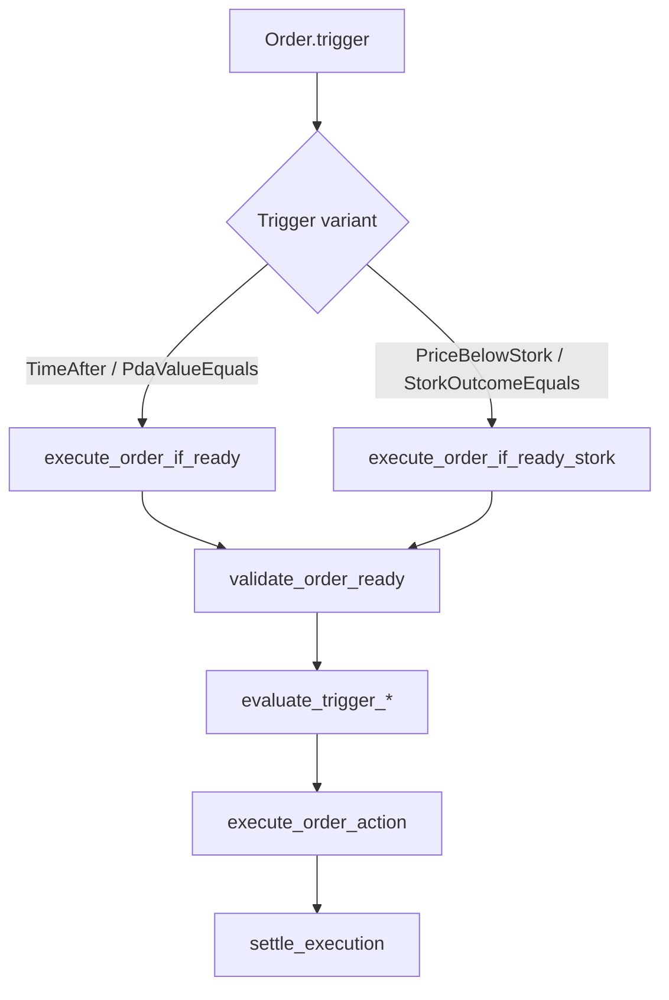
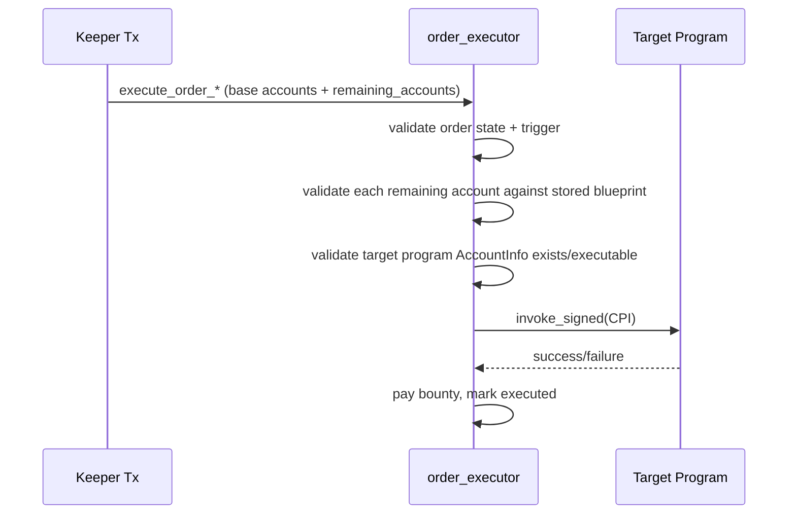
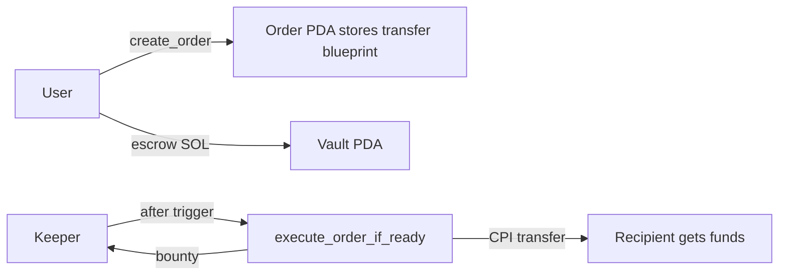

# Order Executor Program Architecture

## 1) What this program is

A Solana program that lets a user:

1. Define a future CPI action now (`create_order`)
2. Lock SOL escrow in a vault PDA
3. Allow anyone (keeper) to execute that action later when a trigger is true

If you only remember 3 things:

- **Order PDA = plan** (trigger + CPI blueprint)
- **Vault PDA = money** (escrowed SOL)
- **Keeper = caller** (permissionless executor)

---

## 2) Core Accounts and Why They Exist

| Account | Seed | Purpose |
|---|---|---|
| `UserOrderCounter` | `['order_counter', user]` | Tracks `next_order_id` and open-order count for deterministic PDAs |
| `Order` | `['order', user, order_id]` | Stores trigger + CPI blueprint + status flags |
| `Vault` | `['vault', user, order_id]` | System-owned PDA that actually holds escrowed SOL |

Why two PDAs (`Order` and `Vault`) instead of one?

- `Order` is Anchor account data, not appropriate as SOL transfer source for system transfer use cases.
- `Vault` is a system-owned lamport holder specifically for funding payouts and CPI flows.

---

## 3) Order Lifecycle (State Machine)

Key rule: `close_order` is only valid after `executed == true` or `canceled == true`.

---

## 4) Instruction-by-Instruction (What + Why)

### `init_user_counter`

- Creates per-user counter PDA.
- Needed so order IDs are deterministic and monotonic.

### `create_order`

- Validates input and whitelisted target program.
- Creates `Order` + `Vault` PDAs.
- Stores trigger and CPI blueprint (`CpiAction`).
- Transfers `input_amount` lamports from user to vault.

Why needed: separates "decide action now" from "execute later".

### `execute_order_if_ready`

- For base triggers: `TimeAfter`, `PdaValueEquals`.
- Validates order is executable.
- Evaluates trigger.
- Executes stored CPI blueprint.
- Pays keeper bounty and marks order executed.

### `execute_order_if_ready_stork`

- Same execution pipeline, but for Stork-trigger variants.
- Includes explicit `stork_feed` account constraints.

### `cancel_order`

- User-only escape hatch.
- Refunds entire vault lamports to user.
- Marks order canceled.

### `close_order`

- Final cleanup after executed/canceled.
- Decrements open-order counter.
- Closes `Order` account and returns rent to user.
- Drains any remaining vault lamports first.

---

## 5) Trigger Routing

Why split execute instructions?

- Keeps account contracts explicit.
- Avoids ambiguous optional oracle accounts.
- Easier client/keeper instruction building.

---

## 6) CPI Engine (Most Important Part)

The stored `CpiAction` contains:

- `program_id`
- ordered list of CPI account pubkeys + writable flags
- raw instruction data bytes

At execution time, keeper supplies real `AccountInfo`s through `remaining_accounts`.

Expected `remaining_accounts` layout:

1. `action.accounts[0..n]`
2. `action.program_id` account as final entry

Signer behavior:

- Program derives both signer seeds:
  - `order` PDA seeds
  - `vault` PDA seeds
- CPI `AccountMeta.is_signer` is set true when account pubkey equals order or vault PDA.
- Runtime then honors PDA signing through `invoke_signed`.

---

## 7) Security Invariants

1. **Program whitelist**
   - CPI target must be allowed (`System` or `SPL Token`).
2. **Exact account matching**
   - Provided CPI accounts must match stored pubkeys exactly.
3. **No writable escalation**
   - If stored account is read-only, execution cannot make it writable.
4. **Replay resistance**
   - `executed` and `canceled` gates prevent re-execution.
5. **Expiry gate**
   - Expired orders cannot execute.
6. **User authority on control paths**
   - Cancel/close require user signer and PDA constraints.

---

## 8) What this architecture is good at

- Time/PDA-triggered SOL payouts from escrow vault.
- Token transfers where expected authority is an executor PDA.
- Deterministic, auditable delayed execution with clear account constraints.

## 9) Known limitations (intentional)

1. **Stored CPI data is static**
   - Good for fixed-parameter actions.
   - Not ideal for highly state-dependent DeFi instructions.
2. **Whitelist is intentionally narrow**
   - New target programs must be explicitly added.
3. **`init_user_counter` is required once per user**
   - Client should auto-initialize if missing.

---

## 10) Minimal End-to-End Example

That is the full model: **user defines plan + funds vault, keeper executes when trigger is true, program enforces the plan exactly**.
