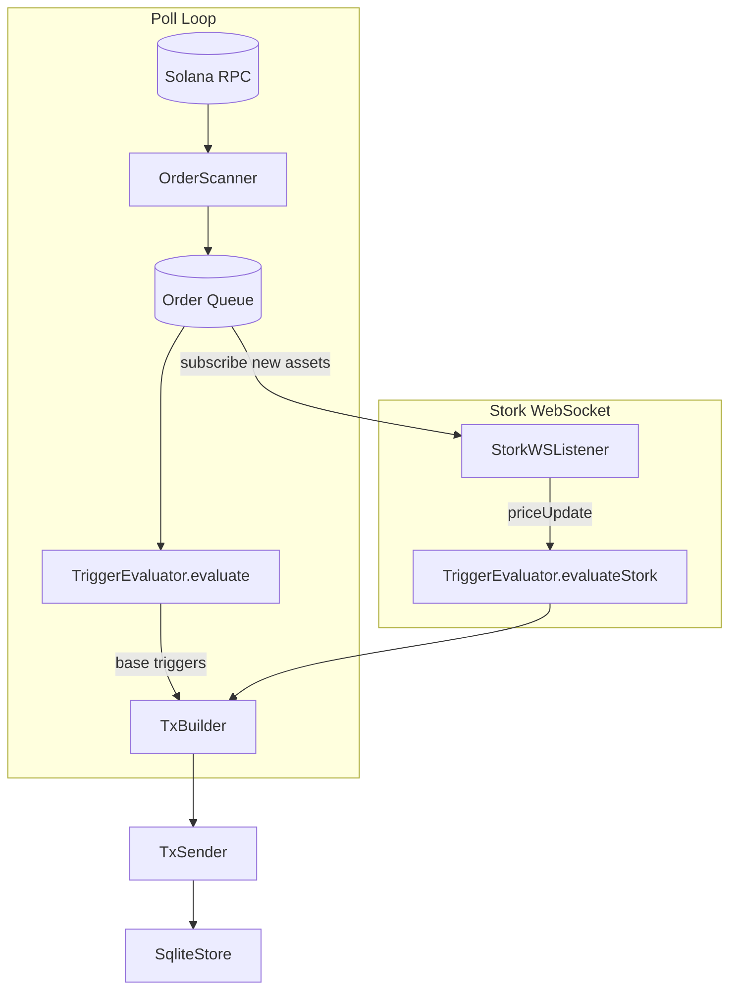
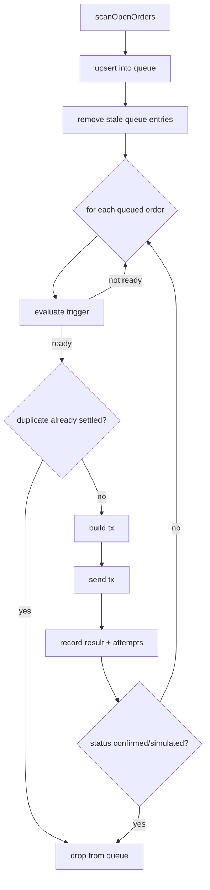
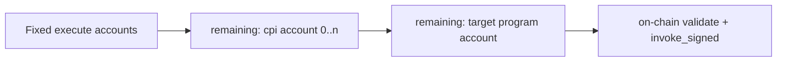
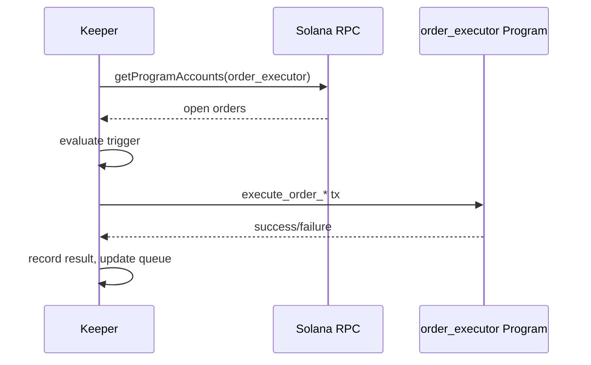

# Keeper Service Architecture

## 1) Keeper Mission

The keeper is an off-chain worker that:

1. Finds open `Order` PDAs
2. Checks whether each trigger is ready
3. Submits execute transactions for ready orders

In short: **discover -> evaluate -> execute -> record**.

---

## 2) Current Runtime Design (as implemented)

Important current-state truth:

- `TxSender` is scaffolded (returns simulated status in dry-run flow).
- `SqliteStore` is currently in-memory behavior, not durable DB writes.
- Stork route: WebSocket-driven; `FeedIdMapper` maps feed_id to asset IDs; Stork push ix is TODO.

---

## 3) Main Loop Behavior

This loop runs every `pollIntervalMs`.

---

## 4) Components and Responsibilities

### `OrderExecutorClient`

- Scans and decodes open order accounts from chain.
- Derives order/vault PDAs from `(user, order_id)`.
- Builds execute/cancel/close instructions.
- Builds vault-based system-transfer CPI action payloads.

### `OrderScanner`

- Thin wrapper around client scan.

### `FeedIdMapper`

- Maps feed_id (32 bytes) to asset ID (e.g. "BTCUSD"). Config: `STORK_FEED_MAP` JSON.

### `StorkWSListener`

- Single WebSocket to Stork; subscribes to asset IDs; emits `priceUpdate` events.

### `TriggerEvaluator`

- Facade dispatching to `TimeAfterEvaluator`, `PdaValueEqualsEvaluator`, `StorkEvaluator`.
- Base triggers (`time_after`, `pda_value_equals`): polled via `evaluate()`.
- Stork triggers: event-driven via `evaluateStork(order, snapshot)` from WebSocket handler.
- `getStorkOrdersForFeed(orders, feedId)` filters orders for a given feed.

### `TxBuilder`

- Builds execute transaction; for stork route, derives `stork_feed` PDA from `candidate.feedId`.
- Stork push instruction (prepend signed update) is TODO; assumes feed updated by Chain Pusher.

### `TxSender`

- Presently returns simulated result scaffold.
- Real send/confirm/retry pipeline is not yet wired.

### `SqliteStore`

- Current code tracks attempts/duplicate suppression in memory.
- Constructor accepts path but persistent sqlite behavior is not implemented yet.

### `MetricsServer`

- Placeholder class; no live metrics exported yet.

---

## 5) Keeper <-> Program Account Contract

For execute calls, keeper must pass:

1. Program fixed accounts (`order`, `vault`, `user`, `keeper`, route-specific account(s), `system_program`)
2. CPI dynamic accounts in exact stored order
3. CPI target program account as final remaining account

If remaining account order or identities differ from stored `CpiAction`, execution fails.

---

## 6) Trigger Support Matrix (Current)

| Trigger | Keeper Evaluates? | Execute Route |
|---|---:|---|
| `TimeAfter` | Yes (poll) | `base` |
| `PdaValueEquals` | Yes (poll) | `base` |
| `PriceBelowStork` | Yes (WebSocket) | `stork` |
| `PriceAboveStork` | Yes (WebSocket) | `stork` |
| `StorkOutcomeEquals` | Yes (WebSocket) | `stork` |

---

## 7) Failure Model and Idempotency

Current protections:

1. Duplicate guard by `(orderPubkey, route)` status in store.
2. Queue entries removed when order is no longer open.
3. Failed attempts recorded with incrementing count.

Because order execution on-chain is state-gated (`executed/canceled`), retrying an already-finalized order is safe and will fail deterministically.

---

## 8) Production-Ready Target (minimal, non-bloated)

Keep the same module boundaries; upgrade internals:

1. **Real `TxSender` pipeline**
   - simulate -> sign -> send -> confirm
   - bounded retry with backoff + error classification
2. **Durable store**
   - real sqlite persistence for attempts/results/checkpoints
3. **Hybrid ingestion**
   - keep polling
   - add websocket program-account subscription for lower latency
4. **Stork route completion**
   - fetch/cache signed updates
   - prepend signed update ix before execute ix

This is enough for reliability without introducing unnecessary system complexity.

---

## 9) End-to-End Keeper View

That is the operational model today: **poll + queue + evaluate + execute scaffold**, with clear extension points for full production behavior.
